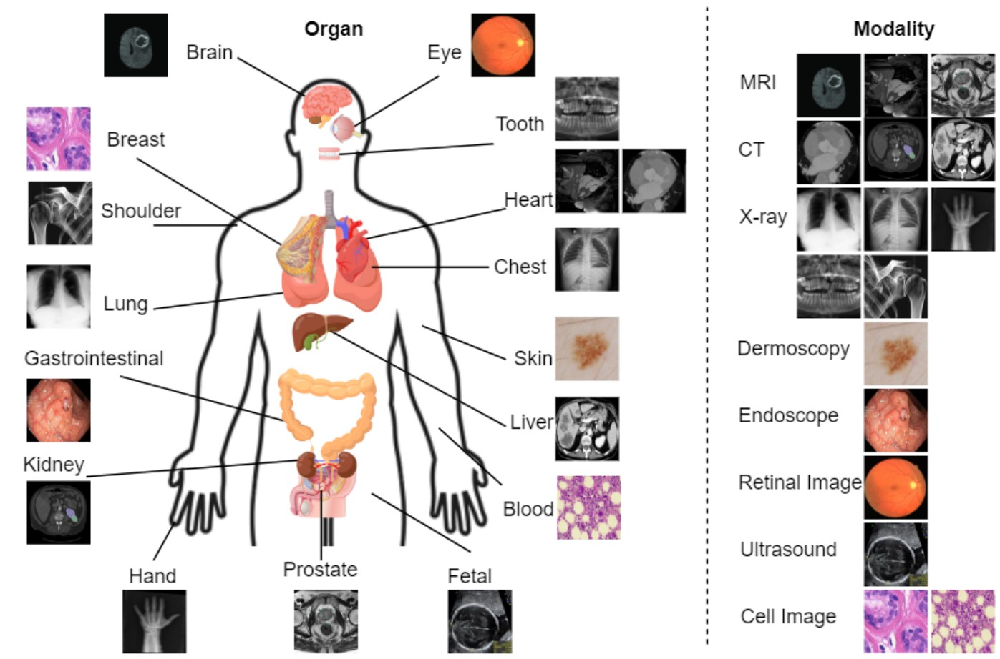
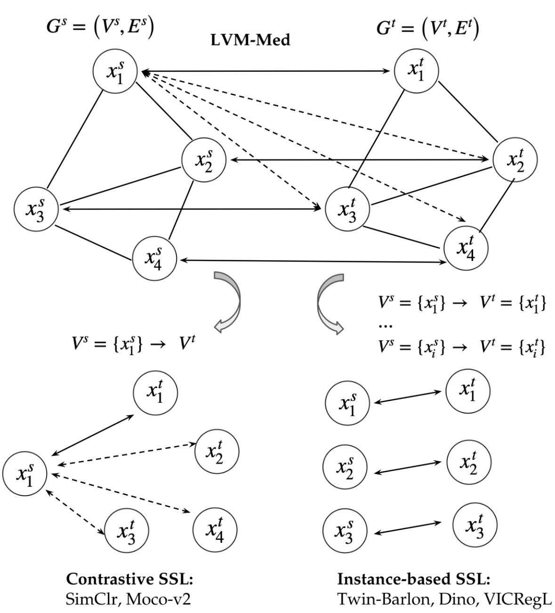

## LVM-Med: Learning Large-Scale Self-Supervised Vision Models for Medical Imaging via Second-order Graph Matching
We release LMV-Med's pre-trained models and demonstrate downstream tasks on 2D-3D segmentations, linear/fully finetuning image classification, and object detection. 

LVM-Med was trained with ~ 1.2 million medical images collected from 55 datasets using a second-order graph matching formulation unifying
current contrastive and instance-based SSL.

<p align="center">
   
</p>

<p align="center">
   
</p>

## Table of contents
* [News](#news)
* [LVM-Med Pretrained Models](#lvm-med-pretrained-models)
* [Prerequisites](#prerequisites)
* [Preparing Dataset](#preparing-datasets)
* [Downstream Tasks](#downstream-tasks)
     * [Segmentation](#segmentation)
     * [Image Classification](#image-classification)
     * [Object Detection](#object-detection)
* [Citation](#citation)
* [Related Work](#related-work)
* [License](#license)

## News
- Cominng soon: [ConvNext](https://arxiv.org/abs/2201.03545) architecture trained by LVM-Med.
- Coming soon: ViT architectures for end-to-end segmentation with better performance reported in the paper.
- **25/06/2023**: We release two pre-trained models of LVM-Med: ResNet-50 and ViT-B. Providing scripts for downstream tasks.

## LVM-Med Pretrained Models
<table>
  <tr>
    <th>Arch</th>
    <th>Params (M)</th>
    <th> 2D Segmentation (Dice) </th>
    <th> 3D Segmentation (3D IoU) </th>
    <th>Weights</th>
  </tr>
  <tr>
    <td>ResNet-50</td>
    <td>25.5M</td>
    <td>83.05</td>
    <td>79.02</td>
    <td> <a href="https://drive.google.com/file/d/11Uamq4bT_AbTf8sigIctIAnQJN4EethW/view?usp=sharing">backbone</a> </td>
  </tr>
  <tr>
    <td>ViT-B</td>
    <td>86.0M</td>
    <td>85.80</td>
    <td>73.85</td>
    <td> <a href="https://drive.google.com/file/d/14bX8wdw-c3VUw3XPAtFMB-wFE03q0eCi/view?usp=sharing">backbone</a> </td>
  </tr>
</table>

After downloading the pre-trained models, please place them in [`checkpoints`](/checkpoints/) folder to use. 

- For **Resnet-50**, we demo **end-to-end** segmentation/classification/object detection.
- For **ViT-B**, we demo **prompt-based** segmentation.

**Important Note:** please check[```dataset.md```](/lmv-med-training-data/dataset.md) to avoid potential leaking testing data when using our model.

**Segment Anything Model-related Experiments**
- For zero-shot segmentation experiments using [SAM](https://github.com/facebookresearch/segment-anything) model, we use the base architecture `sam_vit_b`. You could browse the [`original repo`](https://github.com/facebookresearch/segment-anything) for this pre-trained weight and put it in [`./working_dir/sam_vit_b_01ec64.pth`](./working_dir/) folder to use yaml properly.


## Prerequisites

The code requires `python>=3.8`, as well as `pytorch>=1.7` and `torchvision>=0.8`. Please follow the instructions [here](https://pytorch.org/get-started/locally/) to install both PyTorch and TorchVision dependencies. Installing both PyTorch and TorchVision with CUDA support is strongly recommended.

To set up our project, run the following command:

```bash
git clone https://github.com/duyhominhnguyen/LVM-Med
cd LVM-Med
conda env create -f lvm_med.yml
conda activate lvm_med
```

To **fine-tune for downstream tasks using ResNet-50** in **Section 4f**, we utilize U-Net from `segmentation-models-pytorch` package. To install this library, you can do the following ones: 

1. `git clone https://github.com/qubvel/segmentation_models.pytorch.git` and `cd segmentation_models_pytorch`
2. Access this path in the smp package: `/encoders/resnet.py` and add your download pre-trained weight (you can see our example in [`segmentation_models_pytorch/encoders
/resnet.py`](segmentation_models_pytorch/encoders/resnet.py) at line 77.)
3. Then `pip install segmentation-models-pytorch` to install its dependencies

## Preparing datasets
### For the Brain Tumor Dataset
You could download the `Brain` dataset via Kaggle's [`Brain Tumor Classification (MRI)`](https://www.kaggle.com/datasets/sartajbhuvaji/brain-tumor-classification-mri) and change the name into ```BRAIN```.

### For VinDr
You can download the dataset from this link [`VinDr`](https://www.kaggle.com/datasets/awsaf49/vinbigdata-512-image-dataset) and put the folder ```vinbigdata``` into the folder ```object_detection```. To build the dataset, after downloading the dataset, you can run script ```convert_to_coco.py``` inside the folder object_detection.
```bash
python convert_to_coco.py # Note, please check links inside the code in lines 146 and 158 to build dataset correctly
```
More information can be found in [```object_detection```](./object_detection).

### Others
First you should download the respective dataset that you need to run to the [`dataset_demo`](/dataset_demo/) folder. To get as close results as your work as possible, you could prepare some of our specific dataset (which are not pre-distributed) the same way as we do:
```bash
python prepare_dataset.py -ds [dataset_name]
```
such that: `dataset_name` is the name of dataset that you would like to prepare. After that, you should change paths to your loaded dataset on our pre-defined yaml file in [`dataloader/yaml_data`](/dataloader/yaml_data/).

Currently support for `Kvasir`, `BUID`, `FGADR`, `MMWHS_MR_Heart` and `MMWHS_CT_Heart`.

**Note:** You should change your dataset name into the correct format (i.e., Kvasir, BUID) as our current support dataset name. Or else it won't work as expected.

## Downstream Tasks
### Segmentation
### 1. End-to-End Segmentation
**a) Training Phase:**

**Fine-tune for downstream tasks using ResNet-50**

```bash
python train_segmentation.py -c ./dataloader/yaml_data/buid_endtoend_R50.yml
```
Chaning name of dataset in ``.yml`` configs in [```./dataloader/yaml_data/```](./dataloader/yaml_data/) for other experiments.

**Note**: to apply segmentation models (2D or 3D) using ResNet-50, we suggest normalizing gradient for stable training phases by set:

```bash
clip_value = 1
torch.nn.utils.clip_grad_norm_(net.parameters(), clip_value)
```


[//]: # (#### Fine-tune for downstream tasks using SAM's VIT)

[//]: # (```bash)

[//]: # (python train_segmentation.py -c ./dataloader/yaml_data/buid_endtoend_SAM_VIT.yml)

[//]: # (```)
**b) Inference:**
#### ResNet-50 version

```bash
python train_segmentation.py -c ./dataloader/yaml_data/buid_endtoend_R50.yml -test
```
For the end-to-end version using SAM's ViT, we will soon release a better version than the reported results in the paper.

[//]: # (#### SAM's ViT version)

[//]: # (```bash)

[//]: # (python train_segmentation.py -c ./dataloader/yaml_data/buid_endtoend_SAM_VIT.yml -test)

[//]: # (```)

### 2. Prompt-based Segmentation with ViT-B
**a. Prompt-based segmentation with fined-tune decoder of SAM ([MedSAM](https://github.com/bowang-lab/MedSAM)).**

We run the MedSAM baseline to compare performance by:
#### Train
```bash
python3 medsam.py -c dataloader/yaml_data/buid_sam.yml 
```
#### Inference
```bash
python3 medsam.py -c dataloader/yaml_data/buid_sam.yml -test
```

You could also check our example notebook [`Prompt_Demo.ipynb`](/notebook/Prompt_Demo.ipynb) for results visualization using prompt-based MedSAM and prompt-based SAM with LVM-Med's encoder. Pretrained weight for each SAM decoder model in demo is [here](https://drive.google.com/drive/u/0/folders/1tjrkyEozE-98HAGEtyHboCT2YHBSW15U) and LVM-Med backbone for notebook is the [`lvmmed_large_scale.pth`](https://drive.google.com/file/d/17WnE34S0ylYiA3tMXobH8uUrK_mCVPT4/view). Please download trained models of LVM-Med and MedSAM and put them into [`working_dir/checkpoints`](./working_dir/checkpoints/) folder for running aforementioned notebook file.

**b. Prompt-based segmentation as [MedSAM](https://github.com/bowang-lab/MedSAM) but using LVM-Med's Encoder.**

The training script is similar as MedSAM case but specify the weight model by ```-lvm_encoder```.
#### Train
```bash
python3 medsam.py -c dataloader/yaml_data/buid_lvm_med_sam.yml -lvm_encoder ./working_dir/checkpoints/lvmmed_vit.pth
```

#### Test
```bash
python3 medsam.py -c dataloader/yaml_data/buid_lvm_med_sam.yml -lvm_encoder ./working_dir/checkpoints/lvmmed_vit.pth -test
```
You can check our notebook[`Prompt_Demo.ipynb`](/notebook/Prompt_Demo.ipynb) for visualization.

**c. Zero-shot prompt-based segmentation with Segment Anything Model (SAM) for downstream tasks**

The SAM model without any finetuning using bounding box-based prompts can be done by: 
```bash
python3 zero_shot_segmentation.py -c dataloader/yaml_data/buid_sam.yml
```
### Image Classification
We provide training and testing scripts using LVM-Med's models for Brain Tumor Classification and Diabetic Retinopathy Grading in FGADR dataset (Table 5 in main paper and Table 12 in Appendix).

**a. Training with FGADR**
```bash
# Fully fine-tuned with 1 FCN
python train_classification.py -c ./dataloader/yaml_data/fgadr_endtoend_R50_non_frozen_1_fcn.yml

# Fully fine-tuned with multiple FCNs
python train_classification.py -c ./dataloader/yaml_data/fgadr_endtoend_R50_non_frozen_fcns.yml

# Freeze all and fine-tune 1-layer FCN only 
python train_classification.py -c ./dataloader/yaml_data/fgadr_endtoend_R50_frozen_1_fcn.yml

# Freeze all and fine-tune multi-layer FCN only
python train_classification.py -c ./dataloader/yaml_data/fgadr_endtoend_R50_frozen_fcns.yml
```
To run for ```Brain dataset```, choose other config files ```brain_xyz.yml```in folder [`./dataloader/yaml_data/`](/dataloader/yaml_data).

**b. Inference with FGADR**
```bash
# Fully fine-tuned with 1 FCN
python train_classification.py -c ./dataloader/yaml_data/fgadr_endtoend_R50_non_frozen_1_fcn.yml -test

# Fully fine-tuned with multiple FCNs
python train_classification.py -c ./dataloader/yaml_data/fgadr_endtoend_R50_non_frozen_fcns.yml -test

# Freeze all and fine-tune 1-layer FCN only 
python train_classification.py -c ./dataloader/yaml_data/fgadr_endtoend_R50_frozen_1_fcn.yml -test

# Freeze all and fine-tune multi-layer FCN only
python train_classification.py -c ./dataloader/yaml_data/fgadr_endtoend_R50_frozen_fcns.yml -test
```
### Object Detection
We demonstrate using LVM-Med ResNet-50 for object detection with Vin-Dr dataset. We use Faster-RCNN for the network backbone.
You can access [`object_detection`](./object_detection) folder for more details.

## Citation
Please cite this paper if it helps your research:
```bibtex
@article{nguyen2023lvm,
  title={LVM-Med: Learning Large-Scale Self-Supervised Vision Models for Medical Imaging via Second-order Graph Matching},
  author={Nguyen, Duy MH and Nguyen, Hoang and Diep, Nghiem T and Pham, Tan N and Cao, Tri and Nguyen, Binh T and Swoboda, Paul and Ho, Nhat and Albarqouni, Shadi and Xie, Pengtao and others},
  journal={arXiv preprint arXiv:2306.11925},
  year={2023}
}
```

## Related Work
We use and modify codes from [SAM](https://github.com/facebookresearch/segment-anything) and [MedSAM](https://github.com/bowang-lab/MedSAM) for prompt-based segmentation settings. A part of LVM-Med algorithm adopt data transformations from [Vicregl](https://github.com/facebookresearch/VICRegL), [Deepcluster-v2](https://github.com/facebookresearch/swav?utm_source=catalyzex.com). We also utilize [vissl](https://github.com/facebookresearch/vissl) framework to train 2D self-superived methods in our collected data. Thank the authors for their great work!

## License
Licensed under the [CC BY-NC-ND 2.0](https://creativecommons.org/licenses/by-nc-nd/2.0/) (**Attribution-NonCommercial-NoDerivs 2.0 Generic**). The code is released for academic research use only. For commercial use, please contact [Ho_Minh_Duy.Nguyen@dfki.de](Ho_Minh_Duy.Nguyen@dfki.de)


[//]: # (### f. LVM-Med )

[//]: # (#### Training Phase)

[//]: # (#### Fine-tune for downstream tasks using ResNet-50)

[//]: # ()
[//]: # (```bash)

[//]: # (python train_segmentation.py -c ./dataloader/yaml_data/buid_endtoend_R50.yml)

[//]: # (```)

[//]: # (#### Fine-tune for downstream tasks using SAM's VIT)

[//]: # (```bash)

[//]: # (python train_segmentation.py -c ./dataloader/yaml_data/buid_endtoend_SAM_VIT.yml)

[//]: # (```)

[//]: # (#### Inference)

[//]: # (#### Downstream tasks using ResNet-50)

[//]: # ()
[//]: # (```bash)

[//]: # (python train_segmentation.py -c ./dataloader/yaml_data/buid_endtoend_R50.yml -test)

[//]: # (```)

[//]: # (#### Downstream tasks using SAM's VIT)

[//]: # (```bash)

[//]: # (python train_segmentation.py -c ./dataloader/yaml_data/buid_endtoend_SAM_VIT.yml -test)

[//]: # (```)
