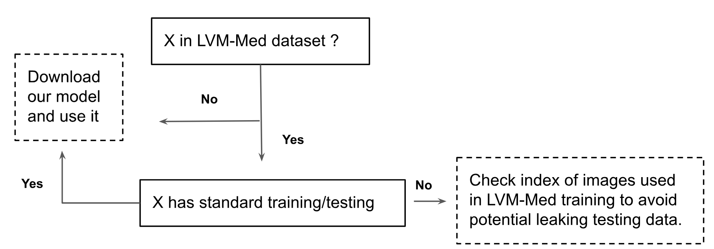

## Tutorial using LMV-Med pre-trained models.
Because we collected public dataset and used them during training phase, there is a possibility of leaking testing data if some paper evaluated again experiments on one of our dataset. To avoid this, we suggest the following settings:

Assume you want to run downstream tasks on dataset ```X```, then please check the below condition to use properly released models:


For dataset without standard splitting, we provided in each folder a .txt file including all of used indexes during the training step (usually```20%```total data). These samples then should not be used in the testing phase. 
